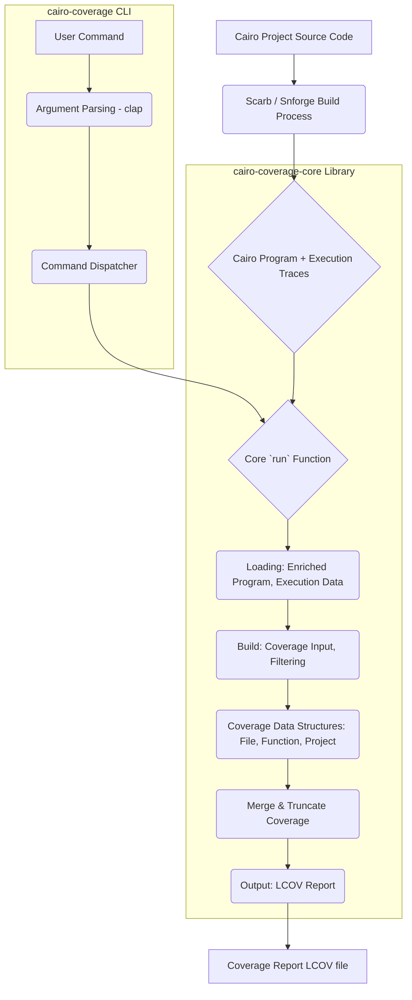

# Architecture of Cairo Coverage

This document outlines the architecture of the `cairo-coverage` project, detailing its structure, components, and their
interactions.

## Overview

The `cairo-coverage` project is structured into two main crates:

1. `cairo-coverage`: The main command-line interface (CLI) application.
2. `cairo-coverage-core`: Contains the core logic for processing execution traces, calculating coverage, and generating
   reports.

## Crate Breakdown

### 1. `cairo-coverage`

This crate serves as the user-facing interface for the `cairo-coverage` tool.

**Role**: Handles command-line argument parsing, user interaction, and dispatches commands to the `cairo-coverage-core`
library.

### 2. `cairo-coverage-core`

This crate encapsulates the core business logic of the coverage tool. It is responsible for loading execution traces,
analyzing Cairo programs, calculating coverage metrics, and formatting the output.

**Role**: Performs the heavy lifting of coverage analysis. Designed to be a reusable library that can be integrated
into other tools if needed.

**Key Modules and their Responsibilities**:

* **`lib.rs`**: The main entry point for the core logic, containing the `run` function that orchestrates the entire
  coverage generation process. It utilizes `rayon` for parallel processing to enhance performance.
* **`args`**: Defines `RunOptions`, which are specific configuration options for the core `run` function.
* **`loading/`**: Responsible for reading, deserializing, and extracting data from various input files (e.g., trace
  files, Cairo programs).
* **`build/`**: Transforms the loaded raw data into intermediate data structures (`CoverageInput`) suitable for
  coverage calculation.
* **`coverage/`**: Defines the data models for representing coverage information.
    * `file`: Stores coverage data for individual Cairo source files.
    * `function`: Stores coverage data for specific functions within files.
    * `project`: Aggregates and manages coverage data for the entire project, allowing for merging and truncation.
* **`hashmap_utils/`**: Provides utility functions, notably for merging coverage data efficiently (e.g., `merge`).
* **`output/`**: Formats the processed coverage data into standard output formats.

**High-Level Execution Flow (`run` function)**:

1. **Initialization**: Sets up ignore patterns from `.cairo-coverage-ignore`.
2. **Load Execution Data**: Reads and deserializes execution trace files.
3. **Parallel Processing**: Each execution trace is processed in parallel:
    * Filters are applied based on project configuration and ignore rules.
    * Execution data is transformed into `CoverageInput`.
    * Project coverage is created from the `CoverageInput`.
4. **Merge Coverage**: Coverage results from parallel processing are merged into a single project coverage report.
5. **Truncation (Optional)**: Coverage data can be optionally truncated (e.g., to report only if a line was covered
   at least once).
6. **Generate Report**: The final aggregated coverage data is formatted into an LCOV string.

## Data Flow (Conceptual)

